# Jamstack

<!-- .slide: data-background-image="slide-images/network-bg.jpg" -->

- Javascript <!-- .element: class="fragment" -->
- API <!-- .element: class="fragment" -->
- Markup <!-- .element: class="fragment" -->

----

## Stack overview


Note: speaker notes FTW!

----

## In Detail

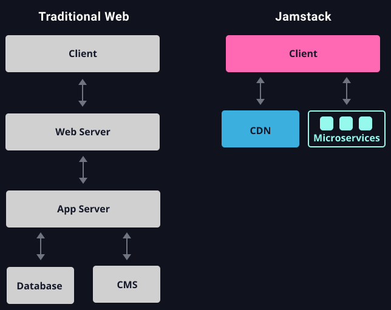

---

## Why Jamstack

<div style="display: flex; gap: 20px; justify-content: center">


</div>
<div style="display: flex; gap: 20px; justify-content: center">


</div>

Note: We gaan kijken naar het meest gebruikte JAMstack framework. met de CDN van de makers hier van.
Deze wordt gebruikt door diverse grote bedrijven, waarom gebruiken ze dit?

----

## Security

- Simplified infrastructure <!-- .element: class="fragment" -->
- Serverless hosting <!-- .element: class="fragment" -->
- Read-only <!-- .element: class="fragment" -->

----

## Scale

- CDN <!-- .element: class="fragment" -->
- Static pre-rendering <!-- .element: class="fragment" -->
- Serverless API <!-- .element: class="fragment" -->

----

## Performance

- CDN Caching <!-- .element: class="fragment" -->
- Fast First Contentful Paint <!-- .element: class="fragment" -->
- Client-side hydration <!-- .element: class="fragment" -->

----

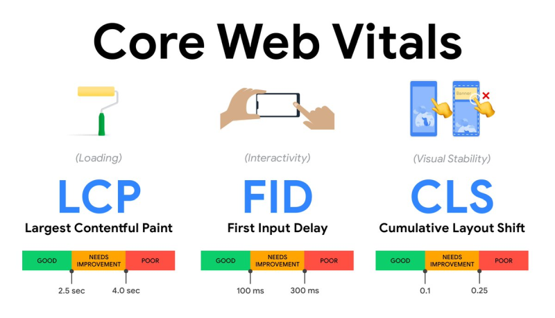

----

<div style="text-align: left; margin-left: 200px">

<br />

</div>

----

## Developer Experience

- Maintainble <!-- .element: class="fragment" -->
- Portable <!-- .element: class="fragment" -->
- Open-Source <!-- .element: class="fragment" -->

Note: Maintainable want de app genereert gewoon HTML. de performancy-heavy taken worden door de CDN geregeld    
Portable want de applicatie is gewoon static HTML en kan op elke CDN draaien  
Open-Source met JS frameworks. Geen propriatary services voor rendering, caching of APIs

---

### Prototype

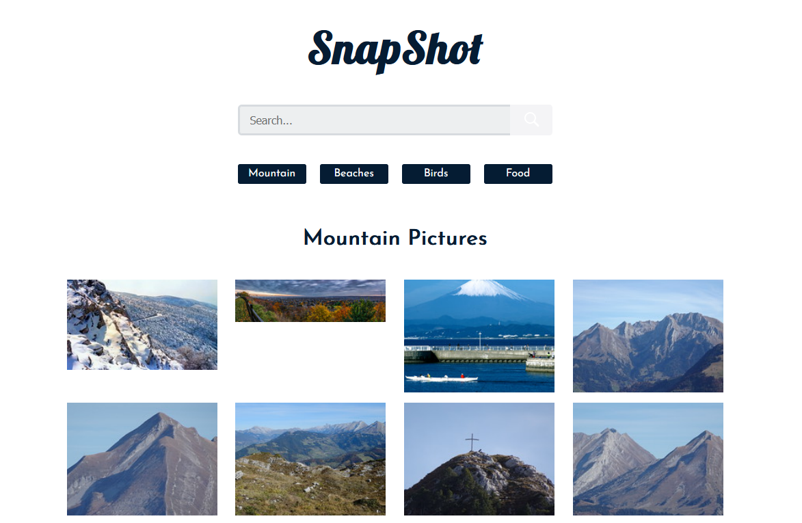

Note: We gaan een van de React demo apps, SnapShot, ombouwen met JamStack

----

### Next.js

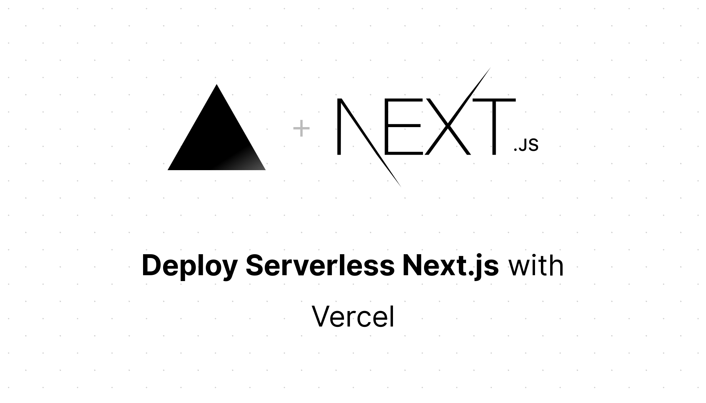

----

### Vercel CDN


----

### Vercel Dashboard

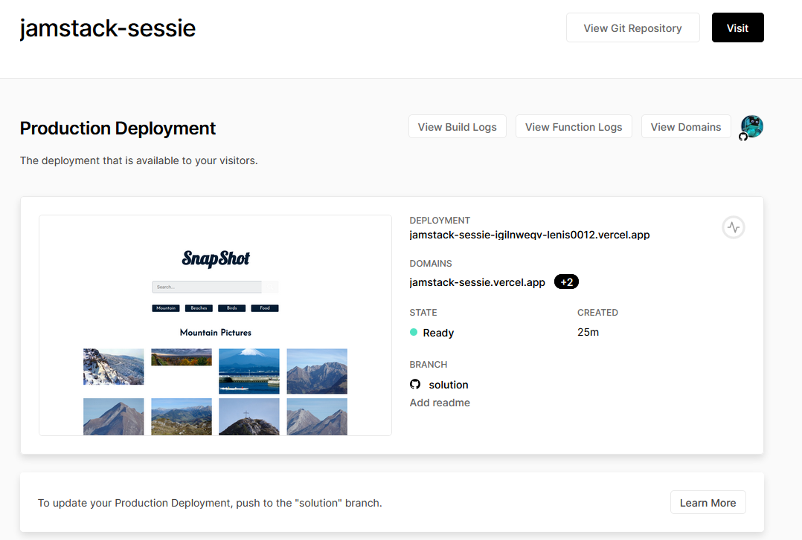

---

### J is for Javascript

- React <!-- .element: class="fragment" -->
- Vue <!-- .element: class="fragment" -->
- Angular* <!-- .element: class="fragment" -->

----

### React

- Well-known
- Reactive by design
- Simple functional interface

----

### React Function

```jsx
function MyComponent () {
  return (
          <div>
            <h1>This is a simple react component</h1>
          </div>
  )
}
```

----

### React Hooks

```jsx
function MyComponent () {
  const [clicks, setClicks] = useState(0)
  let onClick = () => setClicks(clicks + 1)
  return (
          <div>
            <h1>You have clicked the button {clicks} times</h1>
            <button onClick={onClick}>Click Me!</button>
          </div>
  )
}
```

----

### React Hooks

```jsx
function MyComponent () {
  const session = useContext(SessionContext)
  return (
          <div>
            <h1>Welcome!</h1>
            {session.loggedIn && (
                    <p>You are logged in!</p>
            )}
          </div>
  )
}
```

----

### Traditional SPA

```html
<html>
<head>...</head>
<body>
<div id="app"></div>
</body>
</html>
```
```jsx
ReactDOM.render(<MyComponent />, document.getElementById('app'))
```

---

### A is for API

- Authentication <!-- .element: class="fragment" -->
  - Auth0, AWS Cognito, Azure B2C <!-- .element: class="fragment" -->
- Headless CMS <!-- .element: class="fragment" -->
  - Strapi, Ghost, Storyblok <!-- .element: class="fragment" -->
- Serverless APIs <!-- .element: class="fragment" -->
  - AWS Lambda, Vercel, Azure <!-- .element: class="fragment" -->

----

### Authentication

```jsx
return (
        <Auth0Provider
                domain="YOUR_DOMAIN"
                clientId="YOUR_CLIENT_ID"
                redirectUri={window.location.origin}
        >
          <App />
        </Auth0Provider>
)
```
```jsx
const { loginWithRedirect } = useAuth0()
```

----

### CMS


----

### CMS

```js
const { getAccessTokenSilently } = useAuth0()
const token = await getAccessTokenSilently({
  audience: 'https://api.example.com/',
  scope: 'read:posts',
})
const res = await fetch(`${STRAPI_ENDPOINT}/restaurants`, {
  method: 'GET',
  headers: {
    Accept: 'application/json',
    Authorization: `Bearer ${token}`
  }
})
const restaurants = await res.json()
```

----

### Serverless API

`src/pages/api/restaurants.js`
```js
export default async function (req, res) {
  const restaurants = await db.restaurants.find()
  res.setHeader("Cache-Control",
          "s-maxage=1, stale-while-revalidate=59")
  res.json(restaurants)
}
```

---

### M is for Markup

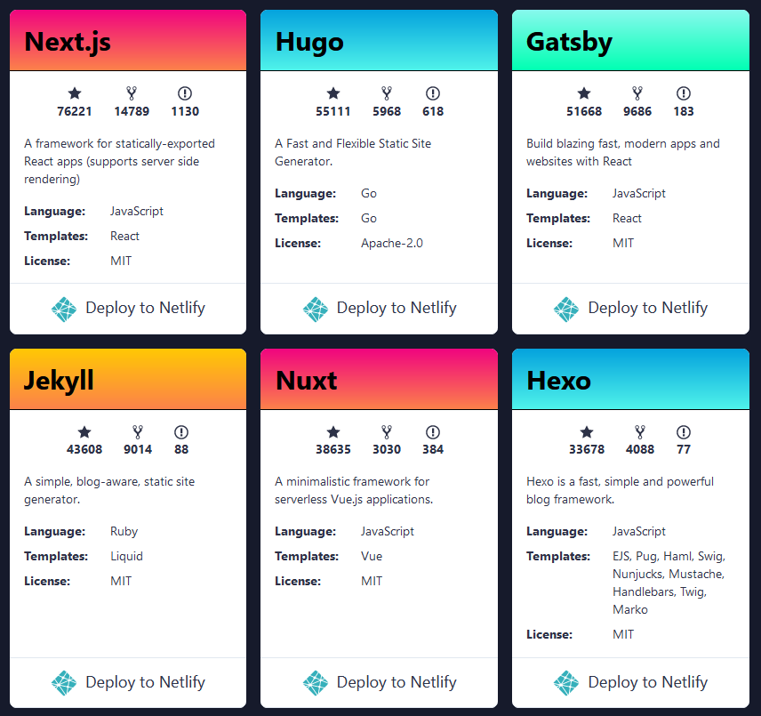 <!-- .element: height="500" -->

----

<div class="position: relative">
  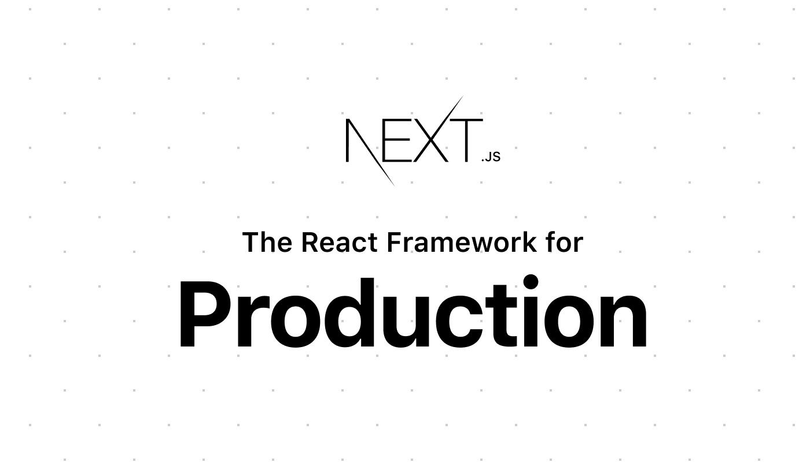
  
</div>

----

## Next.js 12

- SWC: Rust javascript compiler <!-- .element: class="fragment" -->
  - 17x faster than Babel <!-- .element: class="fragment" -->
  - ~25x faster than Typescript <!-- .element: class="fragment" -->
- React 18 support <!-- .element: class="fragment" -->
  - renderToPipeableStream <!-- .element: class="fragment" -->
  - Suspense code-splitting <!-- .element: class="fragment" -->
- Middleware <!-- .element: class="fragment" -->

----

### Next.js

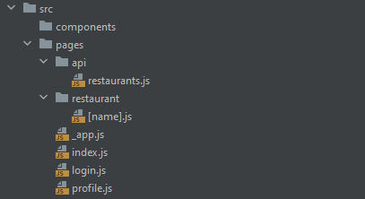

----

### Index page

```jsx
import RestaurantList from '../components/restaurant-list'

export default function IndexPage () {
  return (
          <div>
            <h1>Index page</h1>
            <RestaurantList />
          </div>
  )
}
```

----

### Client-side data fetching

```jsx
export default function IndexPage () {
  const [restaurants, setRestaurants] = useState()
  useEffect(() => fetch(`${STRAPI_ENDPOINT}/restaurants`)
          .then(res => res.json())
          .then(json => setRestaurants(json)), [])
  return restaurants !== undefined 
          ? <RestaurantList restaurants={restaurants} />
          : <Spinner /> // Loading data...
}
```

----

### Static Pre-rendering

```jsx
export default function IndexPage ({ restaurants }) {
  return <RestaurantList restaurants={restaurants} />
}

export async function getStaticProps(context) {
  const res = await fetch(`${STRAPI_ENDPOINT}/restaurants`)
  const restaurants = await res.json()
  return {
    // will be passed to the page component as props
    props: { restaurants },
  }
}
```

----

### Static Pre-rendering

```html
<html>
  <body>
    APP HTML ...
    <script id="__NEXT_DATA__" type="application/json">{
      "props": {
        "restaurants": "..."
      }
    }</script>
    <script src="/__next/static/pages/IndexPage.js" async />
  </body>
</html>
```

----

### Code elimination

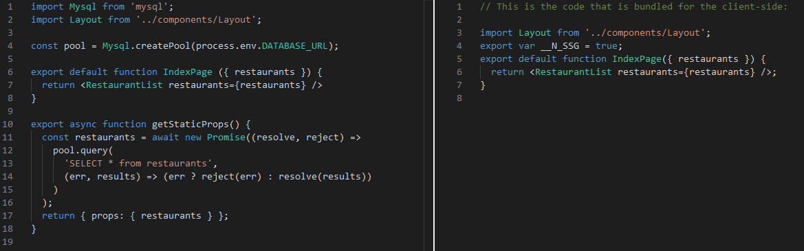

----

### ISR

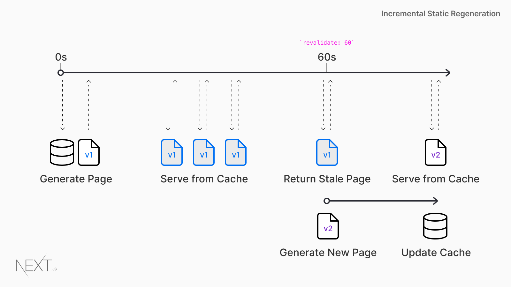

----

### ISR

```jsx
export async function getStaticProps(context) {
  const res = await fetch(`${STRAPI_ENDPOINT}/restaurants`, {
    headers: { Accept: 'application/json' }
  })
  const restaurants = await res.json()
  return {
    // will be passed to the page component as props
    props: { restaurants },
    // Revalidate cached page after 10 seconds
    revalidate: 10 
  }
}
```

----

### ISR Caveat

Pages are only generated upon request

User may see outdated information

----

### Client Revalidation

- SWR: Stale While Revalidate
- React Hooks for data revalidation
- Asynchronous

----

```jsx
import useSWR from 'swr'

export default function IndexPage ({ restaurants }) {
  const { data } = useSWR(`${STRAPI_ENDPOINT}/restaurants`, {
    // Upon first render, will use fallback
    // When the data is revalidated, component will re-render
    fallbackData: restaurants
  })
  
  return <RestaurantList restaurants={data} />
}
```

---

## Nextjs Summary

- File-based router
- Static generation
- Cache revalidation
- DNS-friendly

----

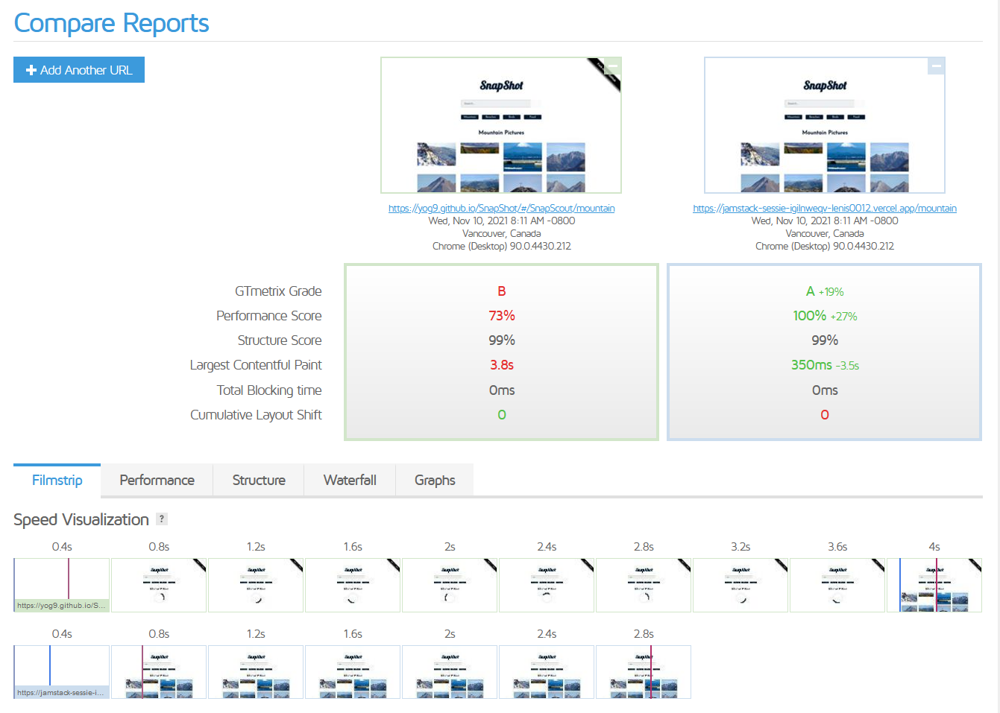

---

## Assignment

- Clone **github.com/lenis0012/jamstack-sessie**
- Checkout `solution`
- Deploy to vercel.com